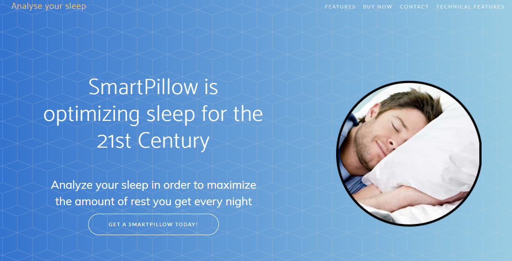
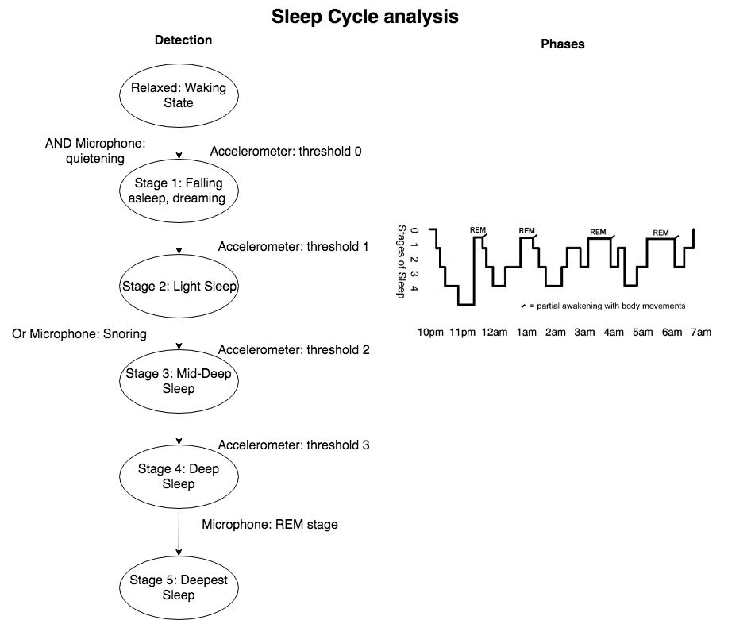
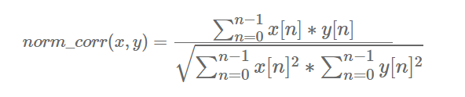

# Documentation notes for CW1

## Tasks

| Done 		| Tasks to do:										| Lead							| Date				|
| :--------:| :--------------------------------------------------------:| :----------------------------:| ----------------:	|
| :ok_hand: | Understand the sensor and how to use it at pro level		| Everyone						| Monday 29th		|
| :ok_hand: | Sleep Pattern Algorithm Development						| Div 							| Wednesday 31st 	|
| :ok_hand: | "JSON formatted messages to MQTT broker"					| Aufar -> maybe Marcus			| Monday 5th		|
| :ok_hand: | Uploading of data -> visual representation of data		| Marcus						| Friday 9th		|
| :ok_hand: | Finish website content 									| Aufar							| Tuesday 13th 		|
| :ok_hand: | Test the algorithm										| Div and Marcus				| Tuesday 13th 		|
| :ok_hand: | Efficiency - interrupts? better script to write back?		| All							| Tuesday 13th 		|
| :ok_hand: | Final Checks on Project | All | Wednesday 14th |

# Video Demo
[Data Reading](https://www.youtube.com/watch?v=G9cwWjbHReQ&feature=youtu.be)
[Data Upload and Display](https://www.youtube.com/watch?v=G3jch4IgFU4&feature=youtu.be)

* These videos show the readings being taken in by the sensors, before being sent to the website to be published on the graph.

# Website

[Click here](http://46.101.14.145/index.html)

[SFTP article](https://www.digitalocean.com/community/tutorials/how-to-use-sftp-to-securely-transfer-files-with-a-remote-server)
* Used to send the csv data to the web server, in order to update the graphs.

## Sleep Cycle analysis

* 5 stages of sleep
* Once you reach phase 5, decreases to 1, and should never reach 5 again.
  * Repeat for stage 4, 3, 2
* Stage 0 represents being awake

### Sleep Rating

* Compares the gathered sleep signal with the ideal data signal using normalized cross correlation
* Gives a value between -1 and 1
* We use 0 to 1, and rate it out of 10

# Initial ideas

## Sleep Cycle Pillow
* Web analysis
* Microphone - as an addition **Ask Ed Stott / Buy Microphone**
* Fire-proof 3d printed case
* Algorithms -> maybe machine learning
  * This depends on how accurate the sensors are
  * Also depends on if we want to try and be accurate or make up some bullshit based on sensor readings
  * Idea is "From all the data, we will be able to deduce the optimal times to begin sleeping in order to get X amount of hours of sleep" or something like that
* Stressed out professionals

## Crash warning system
* Accelerometer to determine speed
* Proximity sensor to determine distance
* Algorithms to detect crash possibility

## Wake-up Pillow alarm
* Unlike first one, this is to wake you up rather than to analyse your sleeping pattern

## Table Tennis monitor
* Accelerometer to give position/speed of shot
* Touch sensor in paddle pad

## Cooking helper : multi-purpose
* Measure no. of stirs for example

## Bike Warning System
* Gyroscope
* Accelerometer - speed of bike

## Delivery Box -> item breaking detector
* Evidence for companies
* Gyroscope
* For determining proper storage -> fragile items

## Fall Detector
* Old people falling
* Sends notification to nurse --> bluetooth
